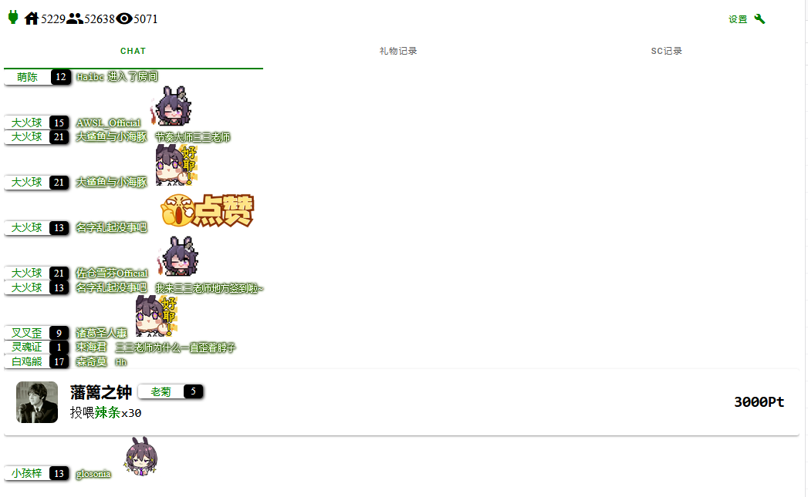
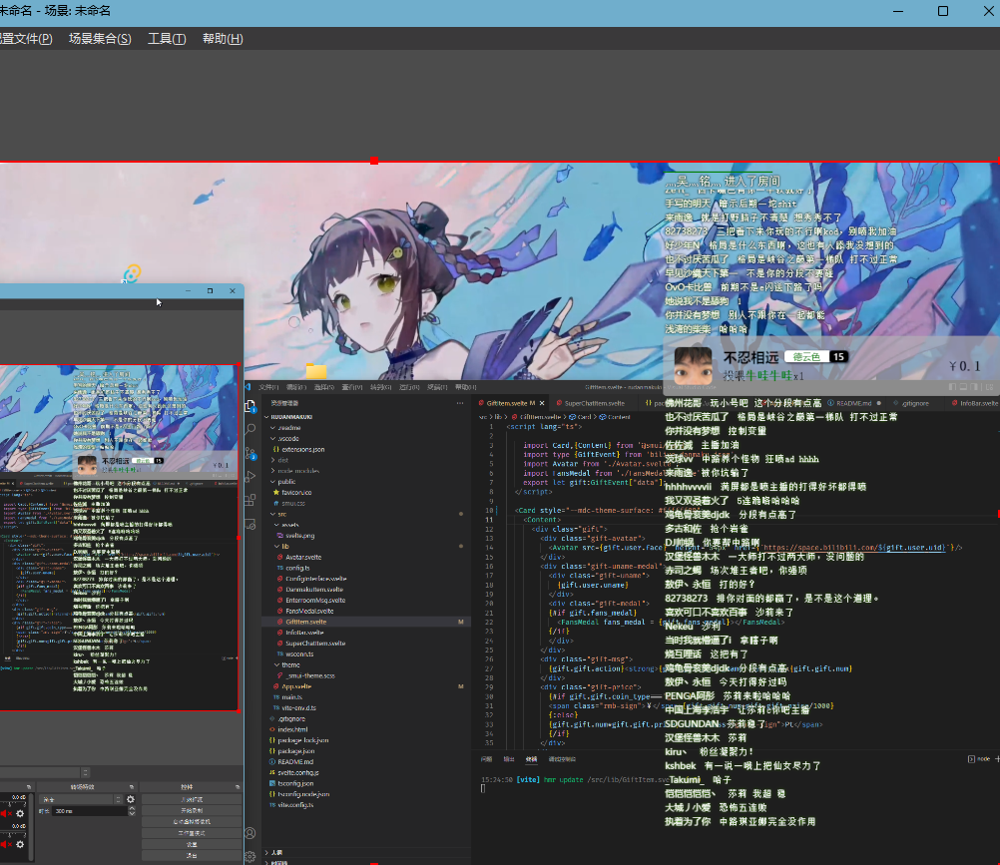
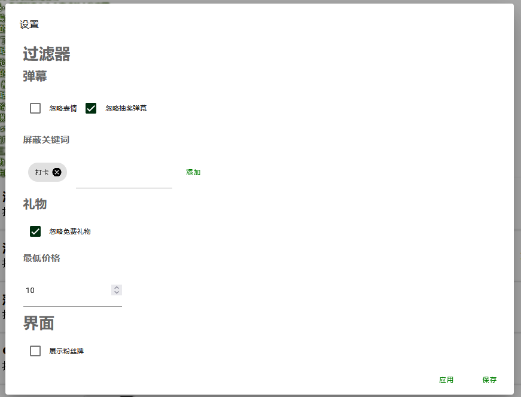

# Rudanmakuki Ru弹幕机 ル弾幕機 
一个基于Svelte和[Rudanmaku Core](https://github.com/4t145/rudanmaku-core)的弹幕机
## 和core一起使用！
### 使用shell作为GUI（如果你不熟悉命令行）
移步
https://github.com/4t145/rudanmaku-shell
### 直接使用core
移步
https://github.com/4t145/rudanmaku-core
## PREVIEW

## BUILD
本项目使用vite哦
```bash
npm install
npm run build
```
## USAGE
在search部分附上房间号和port
例子：
```
http://localhost:3000?roomid=12345678&port=10200
```
### obs



### 设置
（设置保存在localstorage）
